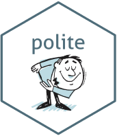
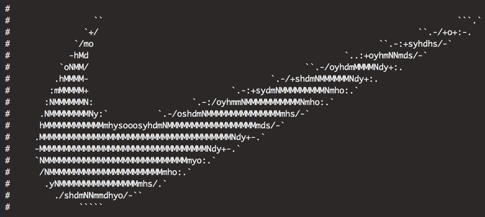
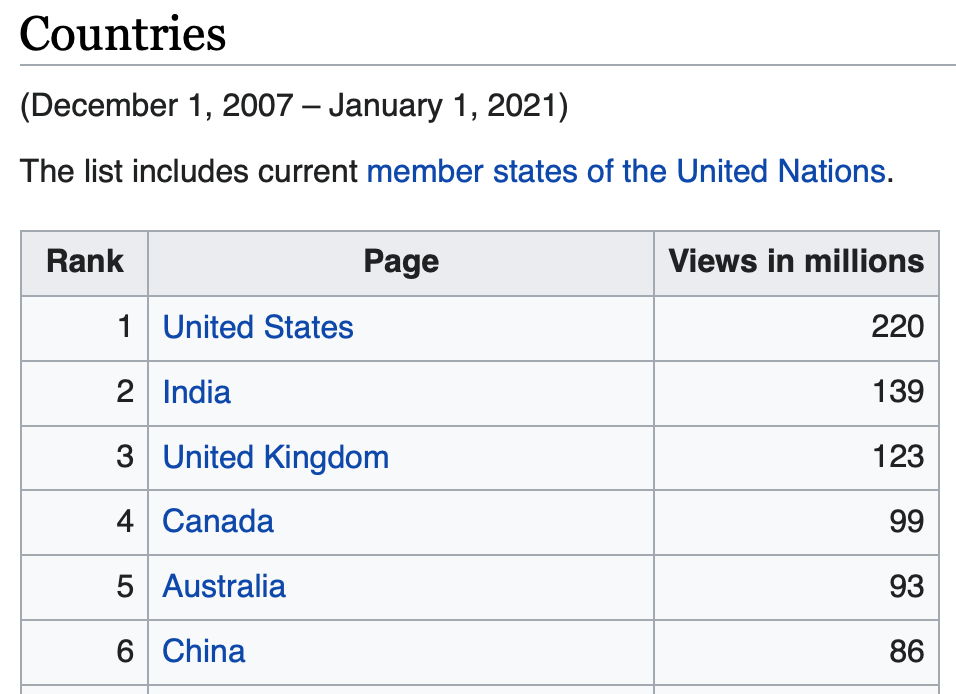

```{r setup, include=FALSE}
options(htmltools.dir.version = FALSE)
```

# About Me

.pull-left[
- Using R since 2008 (courtesy of [University of Florida's Department of Statistics](https://stat.ufl.edu))
- Lead Data Scientist at [Stanley Black & Decker](https://www.stanleyblackanddecker.com)
- Social Media
    - `r fontawesome::fa("linkedin")` [robert-gordon-35090740](https://www.linkedin.com/in/robert-gordon-35090740/)
    - `r fontawesome::fa("github")` [rfgordonjr](https://github.com/rfgordonjr)
    - `r fontawesome::fa("instagram")` [@flashg03](https://www.instagram.com/flashg03/)
]

.pull-right[
.center[


]
]

---


# Introducing Web Scraping but also...

I'll spend plenty of time about what web scraping is and how to do it in different situations.

But this is also a talk about *not* web scraping. I'll start by talking about:

- Other options to consider first.
- Why you shouldn't do it.
- How to check if its allowed.

*Then* i'll talk about what it is and how to do it.

---

# Before scraping, have you tried:

.pull-left[
### Direct download (base)

Just paste the url directly into `read.table`:

```{r}
## From Casella's Statistical Design:
corn_dat <- read.table(file = "http://archived.stat.ufl.edu/casella/StatDesign/WebDataSets/Corn.txt", header = TRUE)
head(corn_dat)
```

]
.pull-right[
### APIs

[API](https://medium.freecodecamp.org/what-is-an-api-in-english-please-b880a3214a82) stands for Application Programming Interface. 

APIs require setting up an account and generating a key to access data.

The website owner creates a very specific way for users to pull information from their site.

- Best case scenario: company makes an API you can interact with via a dedicated R packages.
- Less good scenario: build your own [RESTful](https://www.tutorialspoint.com/restful/) API.
]


---


# Last Resort: Web Scraping

Before describing how this works everyone should first be aware that

- it may violate the site's Terms of Service
- it can cause an unexpected load on the site.

IANAL, but there are many grey areas for legality of scraping websites.

.center[
[__Yes__](https://en.wikipedia.org/wiki/Kelly_v._Arriba_Soft_Corp.#Fair_use_analysis) &nbsp; &nbsp; &nbsp; [__you__](https://en.wikipedia.org/wiki/Associated_Press_v._Meltwater_U.S._Holdings,_Inc.) &nbsp; &nbsp; &nbsp; [__can__](https://petewarden.com/2010/04/05/how-i-got-sued-by-facebook/) &nbsp; &nbsp; &nbsp; [__get__](http://michaelgkeating.com/cant-find-me-on-linkedin-heres-why-i-got-kicked-off/) &nbsp; &nbsp; &nbsp; [__sued__](https://www.docketalarm.com/cases/California_Northern_District_Court/5--14-cv-00068/LinkedIn_Corporation_v._Robocog_Inc/docs/8.pdf).
]

At minimum you should do the following before attempting to scrape a site:

- Read the Terms of Service
- Check for the presence of a `robots.txt` file, i.e. a set of instructions for web robots.

---

# Quick Facts about `robots.txt`

`robots.txt` is typically a single text file informing web scrapers

- which robots are allowed to access the site
- which pages are disallowed to robots

See (http://www.robotstxt.org/robotstxt.html) for full details.

We will review the basics and some examples.

---

# `robots.txt` examples (1/2)

A site with this content in robots.txt disallows all robots from all pages of the site:

```
User-agent: *
Disallow: /
```

Here all robots are banned from 3 specific directories:

```
User-agent: *
Disallow: /cgi-bin/
Disallow: /tmp/
Disallow: /~joe/
```

Here all robots are allowed complete access to the entire site:

```
User-agent: *
Disallow:
```

---

# `robots.txt` examples (2/2)

Here a single robot is excluded:

```
User-agent: BadBot
Disallow: /
```

Here specific pages are disallowed:

```
User-agent: *
Disallow: /~joe/junk.html
Disallow: /~joe/foo.html
Disallow: /~joe/bar.html
```

---

# Where can we find `robots.txt`?

Typically it lives in the root of the website.

For example, if you want to find the `robots.txt` file for 

`https://en.wikipedia.org` 

just type:

`https://en.wikipedia.org/robots.txt`

R lets us build the checking of the `robots.txt` file into our workflow.


---

# Survey of [polite](https://github.com/dmi3kno/polite)

.pull-left[
Lucky for us the [polite](https://github.com/dmi3kno/polite) package exists to check permissions from the `robots.txt` file.


.center[

]

]

.pull-right[
I highly encourage anyone interested in web scraping to visit the github site but the main goals of the package is to encourage

- seeking permission
- pull data slowly
- never asking twice
 
]

---

# Simple `polite` example (not scrapable)

`polite` has 3 main functions worth knowing:

- `bow`: read permissions from `robots.txt`
- `scrape`: pull content of site via `bow` object
- `nod`: use to adjust a scraping url, making sure the new location is allowed by `robots.txt`

```{r, echo=TRUE}
library(polite)
sessionLinkedIn <- bow("https://www.linkedin.com", force = TRUE)
sessionLinkedIn
```

---

# Simple `polite` example (scrapable)

Here we see for wikipedia we are allowed to scrape the site.

```{r, echo=TRUE}
sessionWiki <- bow("https://www.wikipedia.org", force = TRUE)
sessionWiki
```

Before we demonstrate `polite::scrape` we'll discuss how the `rvest` package works, as we'll be using that in concert with `polite`.

---

# Last `polite` example: Nike has fun

```{r, echo=TRUE}
sessionNike <- bow("https://www.nike.com/us/en_us/", force = TRUE)
sessionNike$robotstxt$text %>% substr(start = 1, stop = 42)
```

End of robots.txt:



---


class: inverse, middle, center

# Scraping Basics

---

# Tools for Scraping

.pull-left[

]
.pull-right[
Use clues from the Document Object Model (DOM), and feed the clues into `rvest` functions.

2 options to get clues:

- [Selector Gadget](https://selectorgadget.com)
- Inspect DOM with browser developer tools

The rest of the talk will demonstrate these two options as part of a live Demo with Chrome.
]

---

class: inverse, center, middle

background-image: url("images/DOM.png")
background-position: center
background-size: contain

# Introducing the DOM


---

# Example: Scraping Wikipedia

Grab list of most visited country wikipedia pages (December 1, 2007 – January 1, 2020).

From <https://www.wikipedia.org/wiki/Wikipedia:Multiyear_ranking_of_most_viewed_pages>:

.center[

]

---

# Example: Use nod to modify the url

Recall we already established permission with the `bow` function. 

Use the `nod` function to gain permission from `robots.txt` for the modifed path.

```{r, echo=TRUE, message=FALSE}
library(rvest)
url <- "https://www.wikipedia.org"
newSession <- bow(url) %>% 
  nod(path = "wiki/Wikipedia:Multiyear_ranking_of_most_viewed_pages")
newSession
```

---

# Example: scrape with `rvest`

Having established permission, go ahead and scrape the table into memory:

```{r, echo=TRUE, message=FALSE}
listWikiTables <- scrape(newSession) %>% 
    html_nodes(xpath = '//*[@class="wikitable"]') %>% 
    html_table()
  listWikiTables[[2]] %>% head()
```

---

# Important rvest functions

- `html_nodes`: specify XPath and CSS nodes to select
    - [XPath](https://www.w3schools.com/xml/xpath_intro.asp): Language for navigating XML documents. XML handles *transfer* of data, while HTML handles *presentation* of data.
    - [CSS](https://www.w3.org/Style/CSS/Overview.en.html): a simple way to style an HTML page.
- `html_table`: smartly pulls tabular information
    - assumes no cells span multiple rows
    - assumes headers in first row
- `html_text`: pulls literal text from html tag
- `html_attr`: pulls attribute of the html tag

---

class: inverse, center, middle

# What if we have a dynamic webpage?

???

What do we mean by dynamic?

Situations where we have BOTH:

- Content generated by interacting with UI.
- Changing url string does nothing to update the data.

---

# Motivating Example

Real situation at my job: 
- Updated data lives at intranet site.
- List changes often.
- List generated dynamically from site UI.
- The data changes, but the url stays the same.

---

# Use bots to pull dynamically generated data

.pull-left[
Use a Selenium server


with a Docker container:


]

.pull-right[
[Selenium](https://en.wikipedia.org/wiki/Selenium_(software) is a portable framework for testing web applications.

A [Docker](https://www.docker.com/resources/what-container) container image is a standalone package of software that includes everything needed to run an application.

These are only necessary if interacting with the website does not create a url that lets you recover the web page.
]

---

# 5-step process for scraping dynamic sites

1. [Install Docker](https://docs.docker.com/get-docker/)
2. Install and start a selenium server on the docker container.
3. Call a web browser inside the selenium server using [RSelenium package](https://cran.r-project.org/web/packages/RSelenium/vignettes/basics.html).
4. Navigate to the url and interact with the site.
5. Use Selector Gadget/DOM and use `rvest` as before.

---

class: center, inverse, middle

# Thank you!

<https://github.com/rfgordonjr/useR_atl_webscraping>

---

class: center, inverse, middle

# Appendix

---

# Create a TRUE/FALSE variable for scraping

1. Use the `polite` package to `bow` and ask for permission to scrape.
2. Create a function called to pull `robots.txt` file in a nice list.
3. Write another function to create a boolean TRUE/FALSE variable to build into our workflow a check before scraping.

Function definitions in appendix slides or at the source: <https://www.ddrive.no/post/be-nice-on-the-web/>

```{r, echo=FALSE}
library(robotstxt)
library(ratelimitr)
library(memoise)
#' generated by polite::use_manners()
#' null-coalescing operator. See purr for details.
`%||%` <- function(lhs, rhs) {
  if (!is.null(lhs) && length(lhs) > 0) lhs else rhs
}
polite_fetch_rtxt <- memoise::memoise(
  function(..., user_agent, delay, verbose){
  rt <- robotstxt::robotstxt(...)
  delay_df <- rt$crawl_delay
  crawldelays <- as.numeric(
    delay_df[with(delay_df,useragent==user_agent),"value"]) %||%
    as.numeric(delay_df[with(delay_df, useragent=="*"), "value"]) %||% 0
  rt$delay_rate <- max(crawldelays, delay, 1)
  if(verbose){
    message("Bowing to: ", rt$domain)
    message("There's ",nrow(delay_df),
            " crawl delay rule(s) defined for this host.")
    message("Your rate will be set to 1 request every ",
            rt$delay_rate," second(s).")}
  rt
})
check_rtxt <-function(url, delay, user_agent, force, verbose){
  url_parsed <- httr::parse_url(url)
  host_url <- paste0(url_parsed$scheme, "://", url_parsed$hostname)
  rt <- polite_fetch_rtxt(host_url, 
                          force=force, 
                          user_agent=user_agent,
                          delay=delay, 
                          verbose=verbose)
  is_scrapable <- rt$check(paths=url_parsed$path, 
                           bot=user_agent)

  if(is_scrapable)
    Sys.sleep(rt$delay_rate)
  else
    warning("robots.txt says this path is NOT scrapable for your user agent!")

  is_scrapable
}
```

---

# Pull `robots.txt` into a nice list.

First build a helper function:

```{css, echo=FALSE}
.scroll-box-8 {
  height:8em;
  overflow-y: scroll;
}
.scroll-box-10 {
  height:10em;
  overflow-y: scroll;
}
.scroll-box-12 {
  height:12em;
  overflow-y: scroll;
}
.scroll-box-14 {
  height:14em;
  overflow-y: scroll;
}
.scroll-box-16 {
  height:16em;
  overflow-y: scroll;
}
.scroll-box-18 {
  height:18em;
  overflow-y: scroll;
}
.scroll-box-20 {
  height:20em;
  overflow-y: scroll;
}
.scroll-output {
  height: 90%;
  overflow-y: scroll;
}
.scroll-100 {
  max-height: 50vh;
  overflow-y: auto;
  background-color: inherit;
}
```

.scroll-100[
```{r}
library(robotstxt)
library(ratelimitr)
library(memoise)
#' generated by polite::use_manners()
#' null-coalescing operator. See purr for details.
`%||%` <- function(lhs, rhs) {
  if (!is.null(lhs) && length(lhs) > 0) lhs else rhs
}
```
]

---

# Get `robots.txt` info


```{r}
#' generated by polite::use_manners()
#' function to get robots.txt is structured form. Memoised
polite_fetch_rtxt <- memoise::memoise(
  function(..., user_agent, delay, verbose){
  rt <- robotstxt::robotstxt(...)
  delay_df <- rt$crawl_delay
  crawldelays <- as.numeric(
    delay_df[with(delay_df,useragent==user_agent),"value"]) %||%
    as.numeric(delay_df[with(delay_df, useragent=="*"), "value"]) %||% 0
  rt$delay_rate <- max(crawldelays, delay, 1)
  if(verbose){
    message("Bowing to: ", rt$domain)
    message("There's ",nrow(delay_df),
            " crawl delay rule(s) defined for this host.")
    message("Your rate will be set to 1 request every ",
            rt$delay_rate," second(s).")}
  rt
})
```


---

# Create a boolean TRUE/FALSE variable.

```{r}
#' generated by polite::use_manners()
#' function to check url against robots.txt and enforce appropriate delay
check_rtxt <-function(url, delay, user_agent, force, verbose){
  url_parsed <- httr::parse_url(url)
  host_url <- paste0(url_parsed$scheme, "://", url_parsed$hostname)
  rt <- polite_fetch_rtxt(host_url, 
                          force=force, 
                          user_agent=user_agent,
                          delay=delay, 
                          verbose=verbose)
  is_scrapable <- rt$check(paths=url_parsed$path, 
                           bot=user_agent)

  if(is_scrapable)
    Sys.sleep(rt$delay_rate)
  else
    warning("robots.txt says this path is NOT scrapable for your user agent!")

  is_scrapable
}
```

---


# Create the conditional logic

Then use our function to create a boolean variable:

```{r, echo=TRUE, message=FALSE}
hasPermission <- check_rtxt(url = newSession$url, 
                            delay = 5, 
                            user_agent = newSession$user_agent,
                            force = FALSE,
                            verbose = FALSE)
hasPermission
```

---

## Apply to our examples: LinkedIn

```{r}
sessionLinkedIn$url
sessionLinkedIn$user_agent
check_rtxt(url = sessionLinkedIn$url, 
           delay = 5, 
           user_agent = sessionLinkedIn$user_agent,
           force = FALSE,
           verbose = FALSE)
```

---

## Apply to our examples: Wikipedia

```{r}
sessionWiki$url
sessionWiki$user_agent
check_rtxt(url = sessionWiki$url, 
           delay = 5, 
           user_agent = sessionWiki$user_agent,
           force = FALSE,
           verbose = FALSE)
```

---

## Apply to our examples: Nike

```{r}
sessionNike$url
sessionNike$user_agent
check_rtxt(url = sessionNike$url, 
           delay = 5, 
           user_agent = sessionNike$user_agent,
           force = FALSE,
           verbose = FALSE)
```

---

# Example: scrape with `rvest`

If we have permission, go ahead and scrape the table into memory:

```{r, echo=TRUE, message=FALSE}
if(hasPermission){
  listWikiTables <- scrape(newSession) %>% 
    html_nodes(xpath = '//*[@class="wikitable"]') %>% 
    html_table()
  listWikiTables[[2]] %>% head()
} else {
  paste("No permission.")
}
```

---

# Quick tangent: Docker + Selenium does more than just web scraping

> Selenium is a portable software-testing framework for web applications.

Selenium can be used for *any* software related to web deployment. Some other R-specific examples include:

1. [Persistent reproducible reporting](https://cran.r-project.org/web/packages/liftr/vignettes/liftr-intro.html)
2. [Testing](http://rpubs.com/johndharrison/13408) and [deploying shiny apps](https://www.shinyproxy.io).

These topics are outside the scope of this talk but worth noting as relevant subjects for an R user group.
