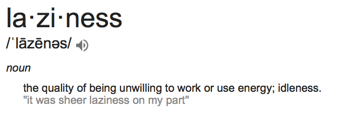

```{r setup, include=FALSE}
options(htmltools.dir.version = FALSE)
```

# About Me

.pull-left[
- Using R since 2008 (courtesy of [University of Florida's Department of Statistics](https://stat.ufl.edu))
- Lead Data Scientist at [Stanley Black & Decker](https://www.stanleyblackanddecker.com)
- Social Media
    - `r fontawesome::fa("linkedin")` [robert-gordon-35090740](https://www.linkedin.com/in/robert-gordon-35090740/)
    - `r fontawesome::fa("github")` [rfgordonjr](https://github.com/rfgordonjr)
    - `r fontawesome::fa("instagram")` [@flashg03](https://www.instagram.com/flashg03/)
]

.pull-right[
.center[


]
]

---

# Motivation: Focused Laziness




Laziness is indistinguishable from efficiency when you work towards automation rather than repetitive tasks.

[Never copy/paste if you don't have to.](https://portswigger.net/daily-swig/underestimated-dangers-of-copy-and-paste-exposed)


???

I'd rather dedicate work or energy to automating a task (pulling data from the web) with the press of a button than navigating to a site once a month, and copying and pasting data, esp since I know the website information will change over time. 

---

# Introducing Web Scraping but also...

I'll spend plenty of time about what web scraping is and how to do it in different situations.

But this is also a talk about *not* web scraping. I'll start by talking about:

- Other options to consider first.
- Why you shouldn't do it.
- How to check if its allowed.

*Then* i'll talk about what it is and how to do it.

---

# Methods to consider before scraping:

Have you tried:

- Direct download (base)
- APIs

---

# Direct Download

This might be the best-case scenario. 

Copy/paste the url of the data's location to a function in R.

```{r}
## From Casella's Statistical Design:
corn_dat <- read.table(file = "http://archived.stat.ufl.edu/casella/StatDesign/WebDataSets/Corn.txt", header = TRUE)
head(corn_dat)
```

---

# APIs

[API](https://medium.freecodecamp.org/what-is-an-api-in-english-please-b880a3214a82) stands for Application Programming Interface. 

APIs typically require setting up an account and generating a key to access data.

Generally APIs

- are easy to use.
- standardize the ways customers and employees interact with data. 

The website owner creates a very specific way for users to pull information from their site.

- Best case scenario: company makes an API you can interact with via a dedicated R packages.
- Less good scenario: build your own [RESTful](https://www.tutorialspoint.com/restful/) API.

---

# Last Resort: Web Scraping

Before describing how this works everyone should first be aware that

- it may violate the site's Terms of Service
- it can cause an unexpected load on the site.

IANAL, but there are many grey areas for legality of scraping websites.

.center[
[__Yes__](https://en.wikipedia.org/wiki/Kelly_v._Arriba_Soft_Corp.#Fair_use_analysis) &nbsp; &nbsp; &nbsp; [__you__](https://en.wikipedia.org/wiki/Associated_Press_v._Meltwater_U.S._Holdings,_Inc.) &nbsp; &nbsp; &nbsp; [__can__](https://petewarden.com/2010/04/05/how-i-got-sued-by-facebook/) &nbsp; &nbsp; &nbsp; [__get__](http://michaelgkeating.com/cant-find-me-on-linkedin-heres-why-i-got-kicked-off/) &nbsp; &nbsp; &nbsp; [__sued__](https://www.docketalarm.com/cases/California_Northern_District_Court/5--14-cv-00068/LinkedIn_Corporation_v._Robocog_Inc/docs/8.pdf).
]

At minimum you should do the following before attempting to scrape a site:

- Read the Terms of Service
- Check for the presence of a `robots.txt` file, i.e. a set of instructions for web robots.

---

# Quick Facts about `robots.txt`

`robots.txt` is typically a single text file informing web scrapers

- which robots are allowed to access the site
- which pages are disallowed to robots

See (http://www.robotstxt.org/robotstxt.html) for full details.

We will review the basics and some examples.

---

# `robots.txt` examples (1/2)

A site with this content in robots.txt disallows all robots from all pages of the site:

```
User-agent: *
Disallow: /
```

Here all robots are banned from 3 specific directories:

```
User-agent: *
Disallow: /cgi-bin/
Disallow: /tmp/
Disallow: /~joe/
```

Here all robots are allowed complete access to the entire site:

```
User-agent: *
Disallow:
```

---

# `robots.txt` examples (2/2)

Here a single robot is excluded:

```
User-agent: BadBot
Disallow: /
```

Here specific pages are disallowed:

```
User-agent: *
Disallow: /~joe/junk.html
Disallow: /~joe/foo.html
Disallow: /~joe/bar.html
```

---

# Where can we find `robots.txt`?

Typically it lives in the root of the website.

For example, if you want to find the `robots.txt` file for 

`https://en.wikipedia.org` 

just type:

`https://en.wikipedia.org/robots.txt`

R lets us build the checking of the `robots.txt` file into our workflow.


---

# Survey of [polite](https://github.com/dmi3kno/polite)

.pull-left[
Lucky for us the [polite](https://github.com/dmi3kno/polite) package exists to check permissions from the `robots.txt` file.


.center[

]

]

.pull-right[
I highly encourage anyone interested in web scraping to visit the github site but the main goals of the package is to encourage

- seeking permission
- pull data slowly
- never asking twice
 
]

---

# Simple `polite` example (not scrapable)

`polite` has 3 main functions worth knowing:

- `bow`: read permissions from `robots.txt`
- `scrape`: pull content of site via `bow` object
- `nod`: use to adjust a scraping url, making sure the new location is allowed by `robots.txt`

```{r, echo=TRUE}
library(polite)
sessionLinkedIn <- bow("https://www.linkedin.com", force = TRUE)
sessionLinkedIn
```

---

# Simple `polite` example (scrapable)

Here we see for wikipedia we are allowed to scrape the site.

```{r, echo=TRUE}
sessionWiki <- bow("https://www.wikipedia.org", force = TRUE)
sessionWiki
```

Before we demonstrate `polite::scrape` we'll discuss how the `rvest` package works, as we'll be using that in concert with `polite`.

---

# Last `polite` example: Nike has fun

```{r, echo=TRUE}
sessionNike <- bow("https://www.nike.com/us/en_us/", force = TRUE)
sessionNike$robotstxt$text %>% substr(start = 1, stop = 42)
```

End of robots.txt:


---

# Create a TRUE/FALSE variable for scraping

1. Use the `polite` package to `bow` and ask for permission to scrape.
2. Create a function called to pull `robots.txt` file in a nice list.
3. Write another function to create a boolean TRUE/FALSE variable to build into our workflow a check before scraping.

Function definitions in appendix slides or at the source: <https://www.ddrive.no/post/be-nice-on-the-web/>

```{r, echo=FALSE}
library(robotstxt)
library(ratelimitr)
library(memoise)
#' generated by polite::use_manners()
#' null-coalescing operator. See purr for details.
`%||%` <- function(lhs, rhs) {
  if (!is.null(lhs) && length(lhs) > 0) lhs else rhs
}
polite_fetch_rtxt <- memoise::memoise(
  function(..., user_agent, delay, verbose){
  rt <- robotstxt::robotstxt(...)
  delay_df <- rt$crawl_delay
  crawldelays <- as.numeric(
    delay_df[with(delay_df,useragent==user_agent),"value"]) %||%
    as.numeric(delay_df[with(delay_df, useragent=="*"), "value"]) %||% 0
  rt$delay_rate <- max(crawldelays, delay, 1)
  if(verbose){
    message("Bowing to: ", rt$domain)
    message("There's ",nrow(delay_df),
            " crawl delay rule(s) defined for this host.")
    message("Your rate will be set to 1 request every ",
            rt$delay_rate," second(s).")}
  rt
})
check_rtxt <-function(url, delay, user_agent, force, verbose){
  url_parsed <- httr::parse_url(url)
  host_url <- paste0(url_parsed$scheme, "://", url_parsed$hostname)
  rt <- polite_fetch_rtxt(host_url, 
                          force=force, 
                          user_agent=user_agent,
                          delay=delay, 
                          verbose=verbose)
  is_scrapable <- rt$check(paths=url_parsed$path, 
                           bot=user_agent)

  if(is_scrapable)
    Sys.sleep(rt$delay_rate)
  else
    warning("robots.txt says this path is NOT scrapable for your user agent!")

  is_scrapable
}
```

---

## Apply to our examples: LinkedIn

```{r}
sessionLinkedIn$url
sessionLinkedIn$user_agent
check_rtxt(url = sessionLinkedIn$url, 
           delay = 5, 
           user_agent = sessionLinkedIn$user_agent,
           force = FALSE,
           verbose = FALSE)
```

---

## Apply to our examples: Wikipedia

```{r}
sessionWiki$url
sessionWiki$user_agent
check_rtxt(url = sessionWiki$url, 
           delay = 5, 
           user_agent = sessionWiki$user_agent,
           force = FALSE,
           verbose = FALSE)
```

---

## Apply to our examples: Nike

```{r}
sessionNike$url
sessionNike$user_agent
check_rtxt(url = sessionNike$url, 
           delay = 5, 
           user_agent = sessionNike$user_agent,
           force = FALSE,
           verbose = FALSE)
```

---

# Example 1: Scraping Wikipedia

Grab list of most visited country wikipedia pages (December 1, 2007 – January 1, 2020).

From <https://www.wikipedia.org/wiki/Wikipedia:Multiyear_ranking_of_most_viewed_pages>:

.center[

]

---

# Example 1: Use nod to modify the url

Recall we already established permission with the `bow` function. 

Since we are visiting a modified part of Wikipedia use the `nod` function to navigate to the new path.

This updates the session’s URL, making sure that the new location can be negotiated against `robots.txt`.

```{r, echo=TRUE, message=FALSE}
library(rvest)
url <- "https://www.wikipedia.org"
newSession <- bow(url) %>% 
  nod(path = "wiki/Wikipedia:Multiyear_ranking_of_most_viewed_pages")
newSession
```

---

# Optional: Create the boolean condition

Then use our function to create a boolean variable:

```{r, echo=TRUE, message=FALSE}
hasPermission <- check_rtxt(url = newSession$url, 
                            delay = 5, 
                            user_agent = newSession$user_agent,
                            force = FALSE,
                            verbose = FALSE)
hasPermission
```

---

# Example 1: scrape with `rvest`

If we have permission, go ahead and scrape the table into memory:

```{r, echo=TRUE, message=FALSE}
if(hasPermission){
  listWikiTables <- scrape(newSession) %>% 
    html_nodes(xpath = '//*[@class="wikitable"]') %>% 
    html_table()
  listWikiTables[[2]] %>% head()
} else {
  paste("No permission.")
}
```

---

# How did we get that?

.pull-left[

]
.pull-right[
Use clues from the Document Object Model (DOM)

- [Selector Gadget](https://selectorgadget.com)
- Browser Developer Tools

Live Demo with Chrome
]

---

class: inverse, center, middle

background-image: url("images/DOM.png")
background-position: center
background-size: contain

# Introducing the DOM


---

# What if we have a dynamic webpage?

What do we mean by dynamic?

Situations where we have BOTH:

- Content generated by interacting with UI.
- Changing url string does nothing to update the data.

---

# Motivating Example

Employee spending at SBD hotels.

- Study where employees stay.
- Cluster hotel locations.
- Find hotel stays far from preferred hotels.
- Plot information on a map.

Problems: 
- Updated hotel list is lives at intranet site.
- List changes often.
- List generated dynamically from site UI.
- The data changes, but the url stays the same.

---

# Use bots to pull dynamically generated data


One way to do this is via a Selenium server...

.center[

]

with a Docker container.
.center[

]

---

# What are these?

[Selenium](https://en.wikipedia.org/wiki/Selenium_(software) is a portable framework for testing web applications.

A [Docker](https://www.docker.com/resources/what-container) container image is a lightweight, standalone, executable package of software that includes everything needed to run an application: code, runtime, system tools, system libraries and settings.

Think of this as similar to virtual machines (VMs) but differ in an important way; containers virtualize the OS instead of the hardware.

---

# Quick tangent: Docker + Selenium does more than just web scraping

> Selenium is a portable software-testing framework for web applications.

Selenium can be used for *any* software related to web deployment. Some other R-specific examples include:

1. [Persistent reproducible reporting](https://cran.r-project.org/web/packages/liftr/vignettes/liftr-intro.html)
2. [Testing](http://rpubs.com/johndharrison/13408) and [deploying shiny apps](https://www.shinyproxy.io).

These topics are outside the scope of this talk but worth noting as relevant subjects for an R user group.

---

# Final tangent: Is it *really* dynamic?

Many website generate content dynamically (i.e. according to user input). That doesn't mean we are forced to use Selenium.

We only need Selenium if interaction with the website is absolutely necessary to generate its content.

Do this one last check to see if you can avoid using Selenium: 

1. Check if interacting with the website creates a url that lets you recover the web page.
2. If copying/pasting the resulting url reproduces the website's content, you can manipulate the url string to suit your needs.

---

# Step 1: Install Docker

---

# Step 2: Start a selenium server on the docker container

---

# Step 3: Call a web browser inside the selenium server using `RSelenium`

---

# Step 4: Navigate to the url and interact with the site

---

# Step 5: Find the DOM and use `rvest` as before

---

class: center, inverse, middle

# Appendix

---

# Pull `robots.txt` into a nice list.

First build a helper function:

```{css, echo=FALSE}
.scroll-box-8 {
  height:8em;
  overflow-y: scroll;
}
.scroll-box-10 {
  height:10em;
  overflow-y: scroll;
}
.scroll-box-12 {
  height:12em;
  overflow-y: scroll;
}
.scroll-box-14 {
  height:14em;
  overflow-y: scroll;
}
.scroll-box-16 {
  height:16em;
  overflow-y: scroll;
}
.scroll-box-18 {
  height:18em;
  overflow-y: scroll;
}
.scroll-box-20 {
  height:20em;
  overflow-y: scroll;
}
.scroll-output {
  height: 90%;
  overflow-y: scroll;
}
.scroll-100 {
  max-height: 50vh;
  overflow-y: auto;
  background-color: inherit;
}
```

.scroll-100[
```{r}
library(robotstxt)
library(ratelimitr)
library(memoise)
#' generated by polite::use_manners()
#' null-coalescing operator. See purr for details.
`%||%` <- function(lhs, rhs) {
  if (!is.null(lhs) && length(lhs) > 0) lhs else rhs
}
```
]

---

# Get `robots.txt` info


```{r}
#' generated by polite::use_manners()
#' function to get robots.txt is structured form. Memoised
polite_fetch_rtxt <- memoise::memoise(
  function(..., user_agent, delay, verbose){
  rt <- robotstxt::robotstxt(...)
  delay_df <- rt$crawl_delay
  crawldelays <- as.numeric(
    delay_df[with(delay_df,useragent==user_agent),"value"]) %||%
    as.numeric(delay_df[with(delay_df, useragent=="*"), "value"]) %||% 0
  rt$delay_rate <- max(crawldelays, delay, 1)
  if(verbose){
    message("Bowing to: ", rt$domain)
    message("There's ",nrow(delay_df),
            " crawl delay rule(s) defined for this host.")
    message("Your rate will be set to 1 request every ",
            rt$delay_rate," second(s).")}
  rt
})
```


---

# Create a boolean TRUE/FALSE variable.

```{r}
#' generated by polite::use_manners()
#' function to check url against robots.txt and enforce appropriate delay
check_rtxt <-function(url, delay, user_agent, force, verbose){
  url_parsed <- httr::parse_url(url)
  host_url <- paste0(url_parsed$scheme, "://", url_parsed$hostname)
  rt <- polite_fetch_rtxt(host_url, 
                          force=force, 
                          user_agent=user_agent,
                          delay=delay, 
                          verbose=verbose)
  is_scrapable <- rt$check(paths=url_parsed$path, 
                           bot=user_agent)

  if(is_scrapable)
    Sys.sleep(rt$delay_rate)
  else
    warning("robots.txt says this path is NOT scrapable for your user agent!")

  is_scrapable
}
```